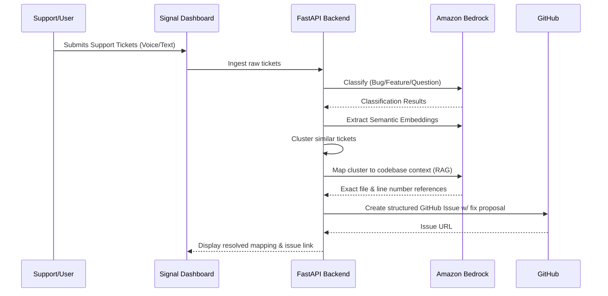
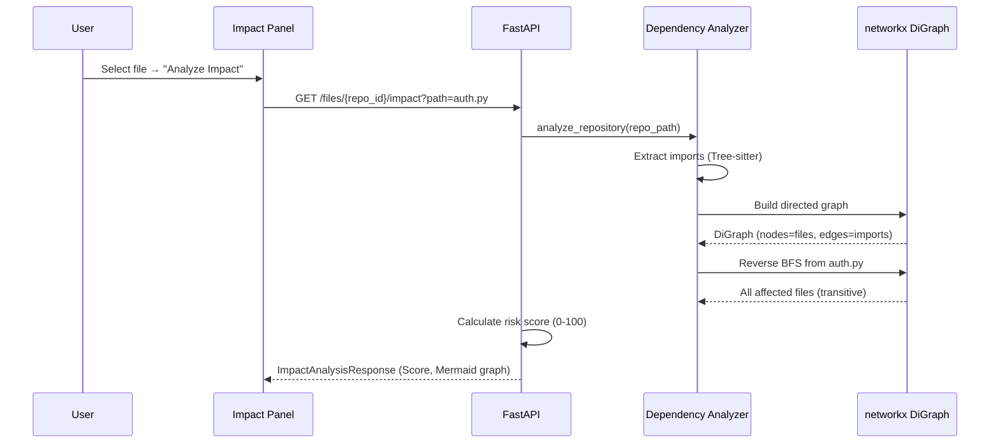
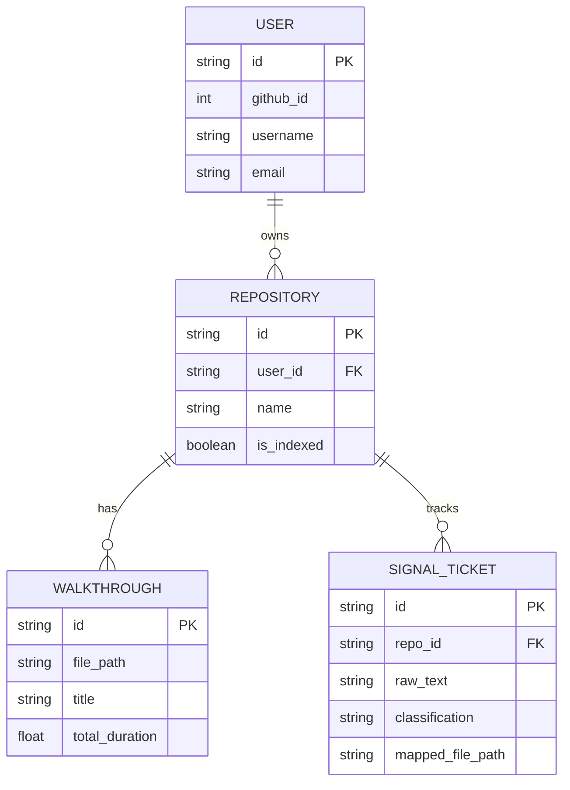

<div align="center">

# DocuVerse AI 🎬

### The World's First Generative Media Documentation Engine

**Stop reading code. Start watching it. Now with Voice-to-Code Support Copilot.**

[](https://logorhythms.in)
[](https://nextjs.org/)
[](https://fastapi.tiangolo.com/)
[](https://aws.amazon.com/)
[](https://aws.amazon.com/bedrock/)

<br/>

> *Connect any GitHub repository → AI parses every file with Tree-sitter → Amazon Nova models generate narrated walkthroughs & map support tickets to code → Press Play and watch code explain itself with synced audio, auto-scrolling, and live highlighting — like a YouTube video for your codebase.*

</div>

---

## 📖 Table of Contents
1. [The Problem & Solution](#-the-problem--solution)
2. [Key Features](#-key-features)
3. [Pricing & Deployment Plans](#-pricing--deployment-plans)
4. [Use Cases & Personas](#-use-cases--personas)
5. [AWS Architecture (Deep Dive)](#-aws-architecture-deep-dive)
6. [System Architecture & Data Flow](#-system-architecture--data-flow)
7. [API Contracts](#-api-contracts)
8. [Quick Start](#-quick-start)
9. [Project Structure](#-project-structure)
10. [Data Models](#-data-models)

---

## 🧠 The Problem & Solution

| Pain Point | Impact | Our Solution |
|---|---|---|
| New developers spend **~58% of their time** understanding code | Slow onboarding | **Auto-Cast:** YouTube-style narrated playback for source code. |
| Support tickets are disconnected from engineering | Lost context, delays | **DocuVerse Signal:** Maps raw user tickets to specific lines of code. |
| Static docs (Markdown, Javadoc) lack flow | Context is lost | **Live Sync:** Audio playback married to line highlighting. |
| Fear of breaking things | Slow refactoring | **Impact Simulator:** Instant DAG-based blast radius analysis. |

---

## ✨ Key Features

### 🎙️ Auto-Cast Walkthrough Player
The flagship feature. A fully custom audio-synced code player:
- **AI-generated narration** — Amazon Nova models write segment-by-segment explanations referencing exact line ranges.
- **Three-tier audio engine** — ElevenLabs (premium) → Edge-TTS (free AI voice) → Browser TTS (instant zero-wait fallback).
- **Real-time sync** — Audio playback is married to code highlighting. As the narrator speaks about lines 42–58, those lines auto-scroll into view and glow.

### 🚨 DocuVerse Signal (Support-to-Code Copilot)
The ultimate bridge between customer support and engineering:
- **End-to-End Pipeline** — Ingests raw support tickets, auto-classifies them, and semantically clusters related issues.
- **AI Code Mapping** — Traces user-reported bugs directly to the specific files and line numbers in your codebase that need fixing.
- **Automated Issue Generation** — Converts grouped tickets into high-quality, structured GitHub Issues with proposed code fixes.


### 🌌 Premium Cinematic UI & Motion Design
- **High-End Dark Theme** — A stunning, highly-polished aesthetic inspired by modern, premium developer tools.
- **Dynamic Scroll Animations** — Powered by Framer Motion, components elegantly react to scroll position, creating an interface that feels alive.
- **Glassmorphism & Gradients** — Deep blue-to-purple accents, sophisticated blur effects, and meticulous typography.

### 📊 Auto-Generated Diagrams
- One click → **Mermaid.js diagrams** rendered from actual code structure.
- Supports **Flowcharts**, **Class Diagrams**, **Sequence Diagrams**, **ER Diagrams**.

### 🔬 Change Impact Simulator
- Builds a **networkx Directed Acyclic Graph** from all imports across the codebase.
- Computes **risk scores (0–100)**, identifies **hotspot files**, detects **circular dependencies**.

### 🤖 GitHub Automation Suite
- **Create Repository**, **Push Documentation to README**, **Create Issue from Impact**, and **Codebase Auto-Fix + PR + Merge**.

---

## 💳 Pricing & Deployment Plans

DocuVerse AI offers flexible pricing tailored for individual developers, growing startups, and large enterprises.

| Tier | Price | Best For | Included Features |
|---|---|---|---|
| **Free / Indie** | $0/mo | Solo developers & Open Source | 1 Repo, 100 Walkthroughs/mo, Edge-TTS audio, standard models. |
| **Pro / Team** | $29/mo/user | Small engineering teams | Unlimited repos, ElevenLabs Premium Voice, DocuVerse Signal Dashboard, GitHub Auto-Fix. |
| **Enterprise** | Custom | Large MNCs & Enterprises | Dedicated AWS Bedrock tenancy, custom model fine-tuning, VPC deployment, SLA guarantee. |

### AWS Self-Hosted Cost Breakdown (Estimated)
If deploying the open-source version on your own AWS infrastructure, typical costs for a small team (approx. 1000 walkthroughs/month):
- **AWS App Runner:** ~$5.00/mo (Compute)
- **Amazon Bedrock (Nova Lite/Micro):** ~$3.00/mo (Inference)
- **Amazon DynamoDB:** Free Tier eligible (~$0.00)
- **Amazon S3 (Audio Storage):** ~$0.50/mo (Storage & Transfer)
- **ElevenLabs (Optional):** $22.00/mo (Creator tier) or use free Edge-TTS.

---

## 👤 Use Cases & Personas

**For Software Engineers (New Hires)**
- *Scenario:* "I just joined and need to understand the payment gateway module."
- *Action:* Open the repo, click `payments.py`, and press Play. DocuVerse narrates the architecture line-by-line.

**For Engineering Managers**
- *Scenario:* "What is the impact of updating the auth dependency?"
- *Action:* Run the Change Impact Simulator to get a visual graph of all affected files and a computed risk score.

**For Customer Support / Product Managers**
- *Scenario:* "Users are reporting a bug on the checkout page."
- *Action:* Pipe the tickets into DocuVerse Signal. It clusters them, finds the exact faulty React component, and auto-generates a GitHub issue for the dev team.

---

## 🔄 System Architecture & Data Flow

### Complete Request Lifecycle

```mermaid
flowchart TB
    subgraph Client["🖥️ Clients (Web)"]
        UI[Next.js UI + Zustand State]
        Signal[Signal Dashboard]
        Player[Walkthrough Player]
        FileExp[File Explorer]
        Sandbox[Live Sandbox]
        Diagrams[Mermaid Diagrams]
        Impact[Impact Simulator]
    end

    subgraph API["⚡ Backend — FastAPI (AWS App Runner)"]
        Auth[Auth Service]
        RepoMgr[Repository Manager]
        Parser[Tree-sitter Parser]
        ScriptGen[Script Generator]
        AudioGen[Audio Generator]
        DiagramGen[Diagram Generator]
        DepAnalyzer[Dependency Analyzer]
        DocGen[Documentation Generator]
        SandboxExec[Sandbox Executor]
    end

    subgraph Storage["💾 AWS Data Layer"]
        DynamoDB[(Amazon DynamoDB)]
        S3[(Amazon S3)]
        FileSystem[(Ephemeral File System)]
    end

    subgraph External["🌐 External Services"]
        GitHub[GitHub API + OAuth]
        Bedrock[Amazon Bedrock Nova]
        TTS[ElevenLabs / Edge-TTS]
    end

    UI --> Auth
    UI --> RepoMgr
    Signal --> RepoMgr
    Player --> ScriptGen
    Player --> AudioGen
    FileExp --> RepoMgr
    Sandbox --> SandboxExec
    Diagrams --> DiagramGen
    Impact --> DepAnalyzer

    Auth --> GitHub
    RepoMgr --> GitHub
    RepoMgr --> FileSystem
    Parser --> DynamoDB
    ScriptGen --> Bedrock
    ScriptGen --> DynamoDB
    AudioGen --> TTS
    AudioGen --> S3
    DocGen --> Bedrock

    style Client fill:#0d1117,stroke:#58a6ff,stroke-width:2px
    style API fill:#0d1117,stroke:#a371f7,stroke-width:2px
    style Storage fill:#0d1117,stroke:#3fb950,stroke-width:2px
    style External fill:#0d1117,stroke:#d29922,stroke-width:2px
```



### DocuVerse Signal (Voice-to-Code Copilot) Pipeline



### Change Impact Analysis Flow



---

## ☁️ AWS Architecture (Deep Dive)

DocuVerse AI is built entirely on AWS for production, leveraging **5 core AWS services** across compute, AI, database, and storage layers.

### 1. Amazon Bedrock — AI Inference Engine
DocuVerse uses **Amazon Bedrock** as its primary AI backbone, replacing OpenAI entirely. The system calls Amazon's **Nova foundation models** via the **Bedrock Converse API** with intelligent model routing based on task complexity.

| Model | ID | Used For | Trigger Condition |
|-------|-------|----------|-------------------|
| **Amazon Nova Micro** | `nova-micro-v1:0` | Config files, simple explanations | Files < 50 lines |
| **Amazon Nova Lite** | `nova-lite-v1:0` | Function narration, diagrams | Files 50–200 lines |
| **Amazon Nova Pro** | `nova-pro-v1:0` | Multi-file analysis, repo summaries | Files > 200 lines |

### 2. Amazon DynamoDB — NoSQL Database
All persistent application data is stored in **DynamoDB** tables.
- `docusense_users`: User accounts
- `docusense_repositories`: Connected repos
- `docusense_walkthroughs`: Walkthrough scripts
- `docusense_audio_walkthroughs`: Audio metadata
- `docusense_code_chunks`: Indexed code (RAG context)

### 3. Amazon S3 — Audio File Storage
All generated audio files (MP3) are stored in **Amazon S3** (`docusense-audio`), enabling persistent audio that survives container restarts. Audio is proxied through the backend API.

### 4. AWS App Runner — Backend Hosting
The FastAPI backend is deployed as a **containerized service on AWS App Runner**.
- **Runtime:** Docker (Python 3.11-slim)
- **Server:** Gunicorn + Uvicorn ASGI worker (1 worker to avoid in-memory state conflicts)
- **Auto-scaling:** Fully managed by AWS.

---

## 📐 API Contracts

### Base URL
```
Production: https://api.docuverse.ai/api
Local:      http://localhost:8000/api
```

### Core Endpoints

| Method | Endpoint | Description |
|--------|----------|-------------|
| `POST` | `/repositories/connect` | Clone, index & connect a repo |
| `POST` | `/walkthroughs/generate` | Generate AI walkthrough (returns script + S3 audio URL) |
| `GET` | `/files/{repo_id}/dependencies` | Full dependency graph (nodes + edges) |
| `POST` | `/diagrams/generate` | Generate Mermaid diagram (Flowchart, ER, Class) |
| `POST` | `/signal/ingest` | Ingest and classify support tickets |
| `POST` | `/github/implement-fix` | Codebase-wide auto-fix + PR + merge |

---

## 🚀 Quick Start

### Prerequisites
- **Python 3.11+** with pip
- **Node.js 18+** with npm
- **AWS Account** with Bedrock, DynamoDB, S3 access

### 1. Clone the Repository
```bash
git clone https://github.com/nitinog10/Team-GitForge-AI-for-bharat.git
cd DocuVerse-Ai
```

### 2. Backend Setup
```bash
cd backend
python -m venv venv
source venv/bin/activate  # Windows: .\venv\Scripts\Activate.ps1
pip install -r requirements.txt
cp .env.example .env      # Edit .env with your AWS keys
uvicorn app.main:app --reload --reload-dir app --port 8000
```

### 3. Frontend Setup
```bash
cd frontend
npm install
npm run dev
```

---

## 📁 Project Structure

```text
DocuVerse-Ai/
│
├── backend/                          # FastAPI + Python AI Pipeline
│   ├── app/
│   │   ├── api/endpoints/            # 8 endpoint modules (auth, repos, files, signal, etc.)
│   │   ├── services/                 # AWS Bedrock, DynamoDB, Tree-sitter, Signal Logic
│   │   └── models/                   # Pydantic schemas
│   └── repos/                        # Cloned repos
│
├── frontend/                         # Next.js 14 + TypeScript
│   ├── src/
│   │   ├── app/                      # Page routing, dashboard, repo viewer
│   │   ├── components/               # WalkthroughPlayer, Signal Dashboard, Visualizer
│   │   └── lib/                      # Zustand state, API client
│   └── tailwind.config.ts            # Premium dark theme styling
│
└── mcp-server/                       # Model Context Protocol Server (Optional)
```

---

## 🧩 Data Models



---

<div align="center">

**Built with ❤️ by Team Logorhythms**

*Transforming the way developers understand code — one walkthrough at a time.*

</div>
