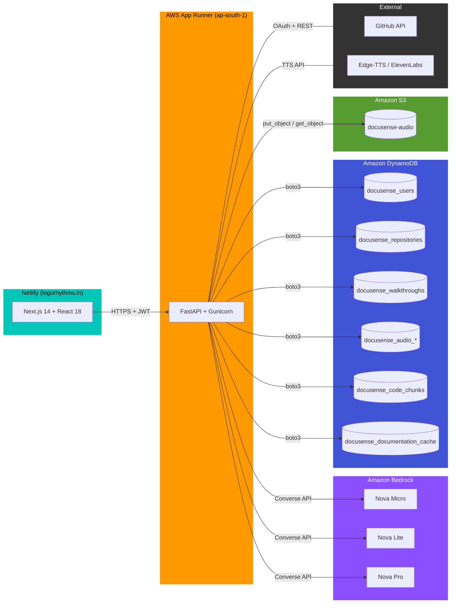
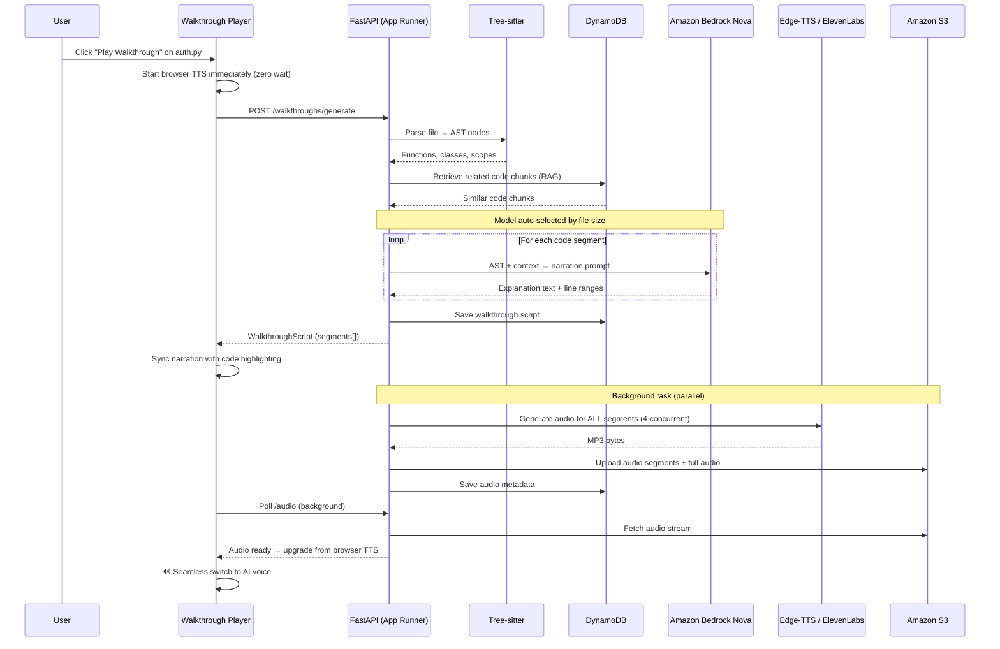
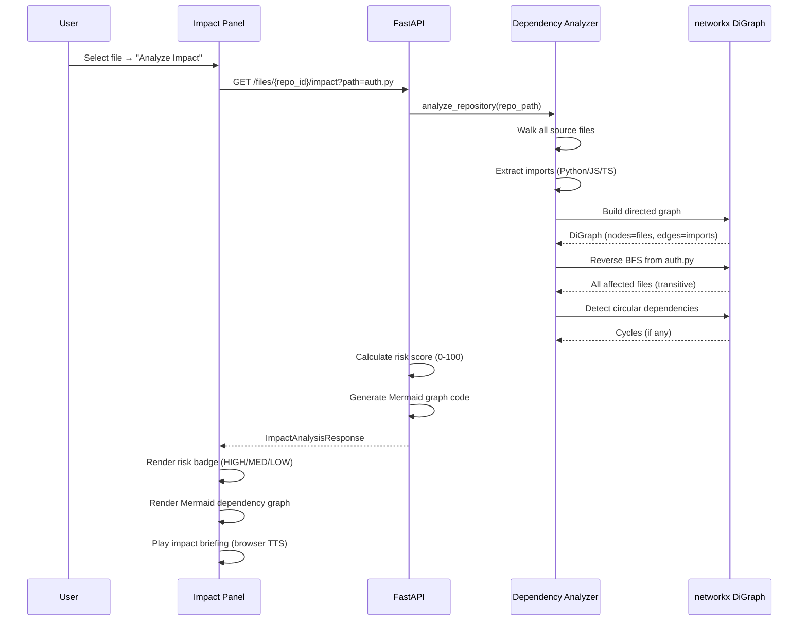
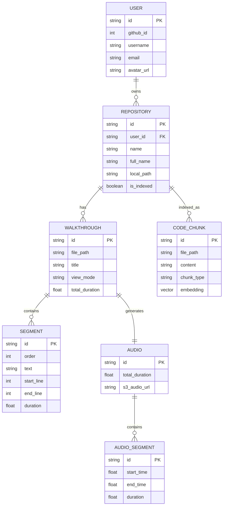

<div align="center">

# DocuVerse AI 🎬

### The World's First Generative Media Documentation Engine

**Stop reading code. Start watching it.**

[](https://logorhythms.in)

[](https://nextjs.org/)
[](https://fastapi.tiangolo.com/)
[](https://aws.amazon.com/)
[](https://aws.amazon.com/bedrock/)
[](https://aws.amazon.com/dynamodb/)
[](https://aws.amazon.com/s3/)
[](https://aws.amazon.com/apprunner/)
[](https://typescriptlang.org/)
[](https://python.org/)
[](https://www.netlify.com/)

<br/>

> *Connect any GitHub repository → AI parses every file with Tree-sitter → Amazon Nova models generate narrated walkthroughs → Press Play and watch code explain itself with synced audio, auto-scrolling, and live highlighting — like a YouTube video for your codebase.*

</div>

---

## 🌐 Live Deployment

| Service | URL | Platform |
|---------|-----|----------|
| **Frontend** | [https://logorhythms.in](https://logorhythms.in) | Netlify + Custom Domain |
| **Backend API** | `https://xpbgkuukxp.ap-south-1.awsapprunner.com/api` | AWS App Runner |
| **API Docs** | `https://xpbgkuukxp.ap-south-1.awsapprunner.com/api/docs` | Swagger UI |

---

## 🧠 The Problem

| Pain Point | Impact |
|---|---|
| New developers spend **~58% of their time** just understanding existing code | Slow onboarding, lost productivity |
| Code documentation is always outdated or nonexistent | Knowledge silos, bus-factor risk |
| Static docs (Markdown, Javadoc) can't convey **flow and reasoning** | Context is lost between files |
| No tool answers the real question: *"Walk me through this code"* | Engineers ask seniors → blocks everyone |

## 💡 Our Solution: Auto-Cast

DocuVerse introduces **Auto-Cast** — the first YouTube-style playback engine for source code.

```
You select a file  →  AI understands it  →  Press ▶ Play  →  An AI Senior Engineer narrates
                                                               while the code auto-scrolls,
                                                               highlights line-by-line, and
                                                               diagrams render in real-time.
```

**It's not a chatbot. It's not a static doc generator. It's a cinematic code walkthrough.**

---

## ✨ Key Features

### 🎙️ Auto-Cast Walkthrough Player
The flagship feature. A fully custom audio-synced code player:
- **AI-generated narration** — Amazon Nova models write segment-by-segment explanations referencing exact line ranges
- **Three-tier audio engine** — ElevenLabs (premium) → Edge-TTS (free AI voice) → Browser TTS (instant zero-wait fallback)
- **Real-time sync** — Audio playback is married to code highlighting. As the narrator speaks about lines 42–58, those lines auto-scroll into view and glow
- **Full playback controls** — Play / Pause / Skip / Seek / Speed (0.5x–2x) / Mute
- **Two view modes** — *Developer Mode* (inputs, outputs, complexity, edge cases) and *Manager Mode* (business-level summary)

### 📊 Auto-Generated Diagrams
- One click → **Mermaid.js diagrams** rendered from actual code structure
- Supports **Flowcharts**, **Class Diagrams**, **Sequence Diagrams**, **ER Diagrams**
- Powered by AST analysis + Amazon Nova AI, not guesswork

### 🔬 Change Impact Simulator
- *"If I change this file, what breaks?"* — answered instantly
- Builds a **networkx Directed Acyclic Graph** from all imports across the codebase
- Computes **risk scores (0–100)**, identifies **hotspot files**, detects **circular dependencies**
- Generates interactive **dependency graphs** with Mermaid.js
- **Zero LLM calls** — pure graph algorithms, runs in < 2 seconds

### 🧪 Live Sandbox
- Execute code snippets directly in the browser
- Inject variables, test edge cases, validate assumptions
- Supports **Python** and **JavaScript**
- Isolated execution environment with timeout protection

### 📝 MNC-Standard Documentation Generator
- Generates **complete repository documentation** — overview, architecture, dependencies, per-file docs
- Amazon Nova Micro for per-file docs (fast & cost-effective), Nova Pro for high-level summaries
- Parallel generation with concurrency control (6 files at once)
- Persistent caching in DynamoDB — documentation survives server restarts

### 🔐 GitHub-Native Authentication
- One-click GitHub OAuth sign-in
- Automatic repository listing from your GitHub account
- JWT-based session management with 30-day persistence
- Supports private repositories

### 🤖 GitHub Automation Suite
Four powerful GitHub integrations built directly into the app:

| Feature | What It Does |
|---------|-------------|
| **Create Repository** | Create new GitHub repos (public/private) from the dashboard — one-click, no context switching |
| **Push Documentation to README** | Export AI-generated docs directly to your repo's README.md with a single click |
| **Create Issue from Impact Analysis** | Turn risk scores, affected files, and refactor suggestions into structured GitHub Issues |
| **Codebase Auto-Fix + PR + Merge** | AI analyses the entire repository, generates fixes across multiple files, creates a branch, opens a PR, auto-merges it, and updates the README with a changelog |

#### Auto-Fix Pipeline (Full Flow)
```
Suggestions  →  Nova Pro identifies files  →  Parallel AI fixes  →  New branch  →  Push all changes
    →  Open PR  →  Auto-merge (squash)  →  Update README with changelog
```

---

## ☁️ AWS Architecture (Deep Dive)

DocuVerse AI is built entirely on AWS for production, leveraging **5 core AWS services** across compute, AI, database, and storage layers.

### AWS Services Overview

```
┌─────────────────────────────────────────────────────────────────────────────┐
│                         AWS Cloud (ap-south-1)                              │
│                                                                             │
│  ┌──────────────────┐  ┌──────────────────┐  ┌──────────────────────────┐   │
│  │  AWS App Runner  │  │ Amazon Bedrock   │  │   Amazon DynamoDB        │   │
│  │                  │  │                  │  │                          │   │
│  │  • FastAPI app   │  │  • Nova Micro    │  │  • docusense_users       │   │
│  │  • Gunicorn +    │  │  • Nova Lite     │  │  • docusense_repositories│   │
│  │    Uvicorn worker│  │  • Nova Pro      │  │  • docusense_walkthroughs│   │
│  │  • Auto-scaling  │  │  • Converse API  │  │  • docusense_audio_*     │   │
│  │  • Docker (3.11) │  │  • Model routing │  │  • docusense_code_chunks │   │
│  │  • Health checks │  │  • 6 concurrent  │  │  • docusense_doc_cache   │   │
│  └──────────────────┘  └──────────────────┘  └──────────────────────────┘   │
│                                                                             │
│  ┌──────────────────┐  ┌──────────────────┐                                 │
│  │  Amazon S3       │  │  AWS IAM         │                                 │
│  │                  │  │                  │                                 │
│  │  • Audio MP3s    │  │  • Service user  │                                 │
│  │  • walkthroughs  │  │  • DynamoDB acces│                                 │
│  │  • Segment audio │  │  • S3 read/write │                                 │
│  │  • Bucket:       │  │  • Bedrock invoke│                                 │
│  │   docusense-audio│  │                  │                                 │
│  └──────────────────┘  └──────────────────┘                                 │
│                                                                             │
└─────────────────────────────────────────────────────────────────────────────┘
```

---

### 1. Amazon Bedrock — AI Inference Engine

DocuVerse uses **Amazon Bedrock** as its primary AI backbone, replacing OpenAI/GPT-4o entirely. The system calls Amazon's **Nova foundation models** via the **Bedrock Converse API** with intelligent model routing based on task complexity.

| Model | ID | Used For | Trigger Condition |
|-------|-------|----------|-------------------|
| **Amazon Nova Micro** | `apac.amazon.nova-micro-v1:0` | Config files, short summaries, simple explanations | Files < 50 lines |
| **Amazon Nova Lite** | `apac.amazon.nova-lite-v1:0` | Function-level narration, diagram generation, standard walkthroughs | Files 50–200 lines |
| **Amazon Nova Pro** | `apac.amazon.nova-pro-v1:0` | Multi-file analysis, repository summaries, complex walkthrough scripts | Files > 200 lines |

**Key Implementation Details:**
- **Unified async client** (`bedrock_client.py`) — wraps `boto3 bedrock-runtime` with `asyncio.get_event_loop().run_in_executor()` for non-blocking calls
- **Cross-region inference profiles** — automatically maps AWS region prefixes (`us` → `us`, `eu` → `eu`, `ap` → `apac`) to Bedrock inference profile ARNs
- **Concurrency control** — configurable max concurrency (default: 6 parallel Bedrock calls) via `BEDROCK_MAX_CONCURRENCY`
- **Latency optimization** — supports `performanceConfig.latency = "optimized"` for time-sensitive requests
- **System prompts** — separate system-level instructions for each task type (narration, documentation, diagrams)
- **Temperature control** — defaults to 0.3 for consistent, factual outputs

**Services powered by Bedrock:**
| Service | How It Uses Bedrock |
|---------|-------------------|
| `script_generator.py` | Generates walkthrough narration scripts with line-range references |
| `diagram_generator.py` | Produces Mermaid.js diagram code (flowcharts, class, sequence, ER) |
| `documentation_generator.py` | Creates MNC-standard repository documentation |
| GitHub Auto-Fix (`github.py`) | Analyses codebase issues and generates multi-file fixes |

---

### 2. Amazon DynamoDB — NoSQL Database

All persistent application data is stored in **DynamoDB** tables in the `ap-south-1` region. This replaces any file-based JSON storage, ensuring data survives container restarts on App Runner.

| Table Name | Partition Key | Purpose | Data Stored |
|------------|--------------|---------|-------------|
| `docusense_users` | `id` (string) | User accounts | GitHub ID, username, email, avatar URL, access tokens |
| `docusense_repositories` | `id` (string) | Connected repos | Name, full_name, clone URL, local path, index status, timestamps |
| `docusense_walkthroughs` | `id` (string) | Walkthrough scripts | File path, title, view mode, segments (text + line ranges), duration |
| `docusense_audio_walkthroughs` | `id` (string) | Audio metadata | Total duration, segment timing, S3 audio URLs, generation status |
| `docusense_code_chunks` | `id` (string) | Indexed code | File path, content, chunk type (function/class/block), embeddings |
| `docusense_automation_history` | `id` (string) | GitHub automation logs | Action type, repo, status, timestamps, PR URLs |
| `docusense_documentation_cache` | `id` (string) | Cached documentation | Repository-level and file-level generated docs |

**Key Implementation Details:**
- **Batch writes** — uses `table.batch_writer()` for efficient bulk operations (e.g., saving all chunks after indexing)
- **Full table scans** with pagination — loads all user repositories on dashboard load
- **Decimal handling** — custom `_safe_int()` / `_safe_float()` converters for DynamoDB's Decimal type
- **Persistence layer** (`persistence.py`) — provides `save_*()` / `load_*()` functions for each entity type
- **Table prefix** — all tables use configurable `DYNAMODB_TABLE_PREFIX` (default: `docusense`) for multi-environment support

---

### 3. Amazon S3 — Audio File Storage

All generated audio files (MP3) are stored in **Amazon S3**, enabling persistent audio that survives container restarts.

| Bucket | Region | Content |
|--------|--------|---------|
| `docusense-audio` | `ap-south-1` | MP3 audio segments + full concatenated walkthroughs |

**Storage Structure:**
```
docusense-audio/
├── walkthrough_{id}/
│   ├── segment_0.mp3        # Individual segment audio
│   ├── segment_1.mp3
│   ├── segment_2.mp3
│   └── full_audio.mp3       # Concatenated full walkthrough
```

**Key Implementation Details:**
- **Upload** — audio bytes uploaded via `s3.put_object()` with `ContentType: audio/mpeg`
- **Download** — streamed back to the frontend via `s3.get_object()` through the `/walkthroughs/{id}/audio/stream` endpoint
- **No pre-signed URLs** — audio is proxied through the backend API (avoids CORS issues and keeps S3 bucket private)
- **Lifecycle** — audio is deleted when a walkthrough is deleted via the API

---

### 4. AWS App Runner — Backend Hosting

The FastAPI backend is deployed as a **containerized service on AWS App Runner**, providing fully managed compute with automatic scaling and zero infrastructure management.

| Configuration | Value |
|--------------|-------|
| **Region** | `ap-south-1` (Mumbai) |
| **Source** | GitHub repository (auto-deploy on push to `main`) |
| **Runtime** | Docker (Python 3.11-slim) |
| **Server** | Gunicorn + Uvicorn ASGI worker |
| **Workers** | 1 (single worker — avoids in-memory state conflicts) |
| **Timeout** | 120 seconds (for long-running AI generation) |
| **Port** | `${PORT}` (injected by App Runner, default 8000) |
| **Health Check** | HTTP GET on `/api/docs` |
| **Scaling** | Auto-managed by App Runner |

**Dockerfile Summary:**
```dockerfile
FROM python:3.11-slim
# System deps: git (repo cloning), build-essential (tree-sitter C extensions), curl
RUN apt-get install -y git build-essential curl
COPY requirements.txt . && pip install -r requirements.txt
COPY . .
RUN mkdir -p repos
CMD gunicorn app.main:app --worker-class uvicorn.workers.UvicornWorker \
    --bind 0.0.0.0:${PORT} --workers 1 --timeout 120
```

**Key Design Decisions:**
- **Single Gunicorn worker** — the app uses `app.state` for shared service instances (VectorStore, Parser). Multiple workers would create separate memory spaces, causing data inconsistency
- **Transparent re-clone** — when App Runner redeploys or scales, the `repos/` directory is empty. On first file access, the backend automatically re-clones the repository from GitHub
- **Environment variables** — all secrets (AWS keys, GitHub OAuth, ElevenLabs) injected via App Runner's environment configuration, never baked into the image

---

### 5. AWS IAM — Identity & Access Management

A dedicated IAM user provides the backend with scoped access to AWS services:

| Permission | Resource | Purpose |
|------------|----------|---------|
| `dynamodb:PutItem`, `GetItem`, `Scan`, `DeleteItem`, `BatchWriteItem` | `docusense_*` tables | Read/write all application data |
| `s3:PutObject`, `GetObject`, `DeleteObject` | `docusense-audio` bucket | Store and retrieve audio files |
| `bedrock:InvokeModel` | Nova Micro/Lite/Pro | Call foundation models for AI generation |

**Credentials** are passed via environment variables (`AWS_ACCESS_KEY_ID`, `AWS_SECRET_ACCESS_KEY`) — never hard-coded.

---

### AWS Data Flow



---

## 🏗️ System Architecture

```
┌─────────────────────────────────────────────────────────────────────┐
│                        DOCUVERSE AI                                 │
├──────────────┬──────────────────────┬───────────────────────────────┤
│              │                      │                               │
│  INGESTION   │   LOGIC ENGINE       │   PRESENTATION LAYER          │
│              │                      │                               │
│  ┌─────────┐ │  ┌────────────────┐  │  ┌─────────────────────────┐  │
│  │ GitHub  │ │  │ DynamoDB       │  │  │ Walkthrough Player      │  │
│  │ Clone   │ │  │ Code Chunks    │  │  │ • Audio-code sync       │  │
│  └────┬────┘ │  └───────┬────────┘  │  │ • Auto-scroll           │  │
│       │      │          │           │  │ • Line highlighting     │  │
│  ┌────▼────┐ │  ┌───────▼────────┐  │  │ • Playback controls     │  │
│  │ Tree-   │ │  │ Amazon Nova    │  │  └─────────────────────────┘  │
│  │ sitter  │ │  │ (Bedrock)      │  │                               │
│  │ Parser  │ │  │ Script Gen     │  │  ┌─────────────────────────┐  │
│  └────┬────┘ │  │ + RAG Context  │  │  │ Mermaid.js Diagrams     │  │
│       │      │  └───────┬────────┘  │  └─────────────────────────┘  │
│  ┌────▼────┐ │          │           │                               │
│  │ AST     │ │  ┌───────▼────────┐  │  ┌─────────────────────────┐  │
│  │ Chunks  │ │  │ ElevenLabs /   │  │  │ Impact Simulator        │  │
│  │ + Index │ │  │ Edge-TTS /     │  │  │ • Dependency DAG        │  │
│  └─────────┘ │  │ Browser TTS    │  │  │ • Risk scoring          │  │
│              │  └───────┬────────┘  │  └─────────────────────────┘  │
│  ┌─────────┐ │          │           │                               │
│  │ Dep.    │ │  ┌───────▼────────┐  │  ┌─────────────────────────┐  │
│  │ Graph   │ │  │ Amazon S3      │  │  │ Live Sandbox            │  │
│  │ (DAG)   │ │  │ Audio Storage  │  │  │ • Python / JS runtime   │  │
│  └─────────┘ │  └────────────────┘  │  └─────────────────────────┘  │
│              │                      │                               │
└──────────────┴──────────────────────┴───────────────────────────────┘
```

### Three-Layer Pipeline

| Layer | What It Does | Key Technology |
|-------|-------------|----------------|
| **1. Ingestion** | Clones repos, parses every file into AST nodes, builds dependency graphs, stores code chunks | Tree-sitter, DynamoDB, networkx |
| **2. Logic** | Takes AST + context → generates narrated scripts, diagrams, risk analysis, documentation | Amazon Bedrock Nova, RAG |
| **3. Presentation** | Renders everything in a cinematic player with synced audio, diagrams, sandbox | Next.js, Framer Motion, Mermaid.js |

---

## 🔄 Data Flow

### Complete Request Lifecycle

```mermaid
flowchart TB
    subgraph Client["🖥️ Frontend — Next.js 14 (Netlify)"]
        UI[React UI + Zustand State]
        Player[Walkthrough Player]
        FileExp[File Explorer]
        Sandbox[Live Sandbox]
        Diagrams[Mermaid Diagrams]
        Impact[Impact Simulator]
    end

    subgraph API["⚡ Backend — FastAPI (AWS App Runner)"]
        Auth[Auth Service]
        RepoMgr[Repository Manager]
        Parser[Tree-sitter Parser]
        ScriptGen[Script Generator]
        AudioGen[Audio Generator]
        DiagramGen[Diagram Generator]
        DepAnalyzer[Dependency Analyzer]
        DocGen[Documentation Generator]
        SandboxExec[Sandbox Executor]
    end

    subgraph Storage["💾 AWS Data Layer"]
        DynamoDB[(Amazon DynamoDB)]
        S3[(Amazon S3)]
        FileSystem[(Ephemeral File System)]
    end

    subgraph External["🌐 External Services"]
        GitHub[GitHub API + OAuth]
        Bedrock[Amazon Bedrock Nova]
        TTS[ElevenLabs / Edge-TTS]
    end

    UI --> Auth
    UI --> RepoMgr
    Player --> ScriptGen
    Player --> AudioGen
    FileExp --> RepoMgr
    Sandbox --> SandboxExec
    Diagrams --> DiagramGen
    Impact --> DepAnalyzer

    Auth --> GitHub
    RepoMgr --> GitHub
    RepoMgr --> FileSystem
    Parser --> DynamoDB
    ScriptGen --> Bedrock
    ScriptGen --> DynamoDB
    AudioGen --> TTS
    AudioGen --> S3
    DocGen --> Bedrock

    style Client fill:#0d1117,stroke:#58a6ff,stroke-width:2px
    style API fill:#0d1117,stroke:#a371f7,stroke-width:2px
    style Storage fill:#0d1117,stroke:#3fb950,stroke-width:2px
    style External fill:#0d1117,stroke:#d29922,stroke-width:2px
```



### Walkthrough Generation Flow (Core)



### Change Impact Analysis Flow



---

## 🛠️ Complete Tech Stack

### Frontend

| Technology | Version | Purpose |
|-----------|---------|---------|
| **Next.js** | 14.0.4 | React framework with App Router, SSR, file-based routing |
| **React** | 18.2.0 | UI library |
| **TypeScript** | 5.3.3 | Type-safe development |
| **Zustand** | 4.4.7 | Lightweight state management (4 stores: user, walkthrough, repository, UI) |
| **React Query** | 5.17.0 | Server state management, caching, background re-fetching |
| **Tailwind CSS** | 3.4.0 | Utility-first CSS framework |
| **Framer Motion** | 10.17.0 | 60fps animations (stagger, rise-up, scale transitions) |
| **Radix UI** | latest | Accessible headless components (Dialog, Dropdown, Tabs, Tooltip, Slider, ScrollArea) |
| **Mermaid.js** | 10.6.1 | Client-side diagram rendering |
| **Prism React Renderer** | 2.3.1 | Code syntax highlighting |
| **next-themes** | 0.4.6 | Dark/light theme switching |
| **Lucide React** | 0.303.0 | Icon library |
| **react-hot-toast** | 2.4.1 | Toast notifications |
| **NextAuth.js** | 4.24.5 | Session provider integration |

### Backend

| Technology | Version | Purpose |
|-----------|---------|---------|
| **FastAPI** | 0.109.0 | Async Python web framework |
| **Gunicorn** | 21.2.0 | Production WSGI/ASGI server |
| **Uvicorn** | 0.27.0 | ASGI server (Gunicorn worker class) |
| **Pydantic** | 2.10.4 | Data validation, 60+ schema models |
| **boto3** | ≥1.34.0 | AWS SDK for Python (DynamoDB, S3, Bedrock) |
| **Tree-sitter** | 0.24.0 | Language-agnostic AST parsing |
| **tree-sitter-python/javascript/typescript/java/go/rust** | various | Language grammar bindings |
| **networkx** | 3.2.1 | Directed graph algorithms for impact analysis |
| **edge-tts** | ≥7.0.0 | Microsoft Edge text-to-speech (free, high quality) |
| **PyGithub** | 2.1.1 | GitHub REST API client |
| **httpx** | 0.26.0 | Async HTTP client for GitHub operations |
| **PyJWT** | 2.11.0 | JWT token creation and validation |
| **cryptography** | 46.0.4 | Cryptographic operations |
| **SQLAlchemy** | 2.0.25 | ORM (available but DynamoDB is primary) |

### AWS Services

| Service | Region | Purpose |
|---------|--------|---------|
| **Amazon Bedrock** | ap-south-1 | AI inference via Nova Micro/Lite/Pro foundation models |
| **Amazon DynamoDB** | ap-south-1 | NoSQL database — 7 tables for all application data |
| **Amazon S3** | ap-south-1 | Object storage for audio MP3 files |
| **AWS App Runner** | ap-south-1 | Managed container hosting with auto-deploy from GitHub |
| **AWS IAM** | Global | Service credentials with least-privilege access |

### Deployment

| Platform | Purpose | Configuration |
|----------|---------|---------------|
| **Netlify** | Frontend hosting | Next.js SSR plugin, custom domain `logorhythms.in`, Node 18 |
| **AWS App Runner** | Backend hosting | Docker container, auto-deploy on git push, single worker |
| **GitHub** | Source control | CI/CD trigger for both Netlify and App Runner |

### Supported Languages (Tree-sitter AST Parsing)

| Language | Grammar | File Extensions |
|----------|---------|----------------|
| Python | `tree-sitter-python` | `.py` |
| JavaScript | `tree-sitter-javascript` | `.js`, `.jsx` |
| TypeScript | `tree-sitter-typescript` | `.ts`, `.tsx` |
| Java | `tree-sitter-java` | `.java` |
| Go | `tree-sitter-go` | `.go` |
| Rust | `tree-sitter-rust` | `.rs` |
| C/C++ | `tree-sitter-c`, `tree-sitter-cpp` | `.c`, `.h`, `.cpp`, `.hpp` |
| Ruby | `tree-sitter-ruby` | `.rb` |
| PHP | `tree-sitter-php` | `.php` |
| Plain text | fallback | `.md`, `.txt`, `.json`, `.yaml`, etc. |

---

## 📐 API Contracts

### Base URL
```
Production: https://xpbgkuukxp.ap-south-1.awsapprunner.com/api
Local:      http://localhost:8000/api
```

All authenticated endpoints require: `Authorization: Bearer <jwt_token>`

### Authentication

| Method | Endpoint | Description |
|--------|----------|-------------|
| `GET` | `/auth/github` | Initiate GitHub OAuth flow → returns `auth_url` |
| `GET` | `/auth/github/callback` | OAuth callback → creates JWT session |
| `GET` | `/auth/me` | Get current authenticated user profile |
| `GET` | `/auth/refresh` | Refresh JWT token |
| `POST` | `/auth/logout` | Logout and invalidate session |
| `GET` | `/auth/verify` | Validate token |

### Repositories

| Method | Endpoint | Description |
|--------|----------|-------------|
| `GET` | `/repositories/github` | List repos from user's GitHub account |
| `POST` | `/repositories/connect` | Clone, index & connect a repo `{ "full_name": "user/repo" }` |
| `GET` | `/repositories/` | List all connected repositories |
| `GET` | `/repositories/{id}` | Get single repository details |
| `GET` | `/repositories/{id}/status` | Poll clone/index status (`cloning` → `indexing` → `ready`) |
| `POST` | `/repositories/{id}/index` | Trigger Tree-sitter parsing + DynamoDB indexing |
| `DELETE` | `/repositories/{id}` | Remove repository and all data |

### File Analysis

| Method | Endpoint | Description |
|--------|----------|-------------|
| `GET` | `/files/{repo_id}/tree` | Recursive file tree with language detection |
| `GET` | `/files/{repo_id}/content?path=` | Raw file content |
| `GET` | `/files/{repo_id}/ast?path=` | Tree-sitter AST (functions, classes, scopes) |
| `GET` | `/files/{repo_id}/dependencies` | Full dependency graph (nodes + edges) |
| `GET` | `/files/{repo_id}/impact?path=&symbol=` | Single-file impact analysis with risk score |
| `GET` | `/files/{repo_id}/codebase-impact` | Full codebase impact — hotspots, risk map |

### Walkthroughs (Auto-Cast)

| Method | Endpoint | Description |
|--------|----------|-------------|
| `POST` | `/walkthroughs/generate` | Generate AI walkthrough `{ repository_id, file_path, view_mode }` |
| `GET` | `/walkthroughs/{id}` | Get walkthrough script with segments |
| `GET` | `/walkthroughs/{id}/audio` | Audio metadata (202 while generating, 200 when ready) |
| `GET` | `/walkthroughs/{id}/audio/stream` | Stream MP3 audio from S3 |
| `GET` | `/walkthroughs/file/{repo_id}?file_path=` | Get all walkthroughs for a file |
| `DELETE` | `/walkthroughs/{id}` | Delete walkthrough + S3 audio + DynamoDB records |

### Documentation

| Method | Endpoint | Description |
|--------|----------|-------------|
| `POST` | `/documentation/{repo_id}/generate` | Generate full repo docs (background task) |
| `GET` | `/documentation/{repo_id}` | Get generated docs (202/404/200) |
| `GET` | `/documentation/{repo_id}/file?path=` | Generate docs for single file (on-demand) |

### Diagrams

| Method | Endpoint | Description |
|--------|----------|-------------|
| `POST` | `/diagrams/generate` | Generate Mermaid diagram `{ repository_id, diagram_type, file_path }` |
| `GET` | `/diagrams/{id}` | Get diagram by ID |

### Sandbox

| Method | Endpoint | Description |
|--------|----------|-------------|
| `POST` | `/sandbox/execute` | Execute code `{ code, language, variables }` |
| `GET` | `/sandbox/languages` | List supported languages |
| `POST` | `/sandbox/validate` | Validate code safety without executing |

### GitHub Automation

| Method | Endpoint | Description |
|--------|----------|-------------|
| `POST` | `/github/create-repo` | Create a new GitHub repository `{ name, description, private }` |
| `POST` | `/github/push-readme` | Push/update README.md `{ owner, repo, content, branch, message }` |
| `POST` | `/github/create-issue` | Create GitHub issue `{ owner, repo, title, body, labels }` |
| `POST` | `/github/implement-fix` | Codebase-wide auto-fix + PR + merge + README update |

### Project Upload

| Method | Endpoint | Description |
|--------|----------|-------------|
| `POST` | `/project/upload-zip` | Upload & index a ZIP file (max 100MB) |

<details>
<summary><b>📋 Example: Generate Walkthrough Request / Response</b></summary>

**Request:**
```json
POST /api/walkthroughs/generate
{
  "repository_id": "repo_abc123",
  "file_path": "src/auth/auth_flow.py",
  "view_mode": "developer"
}
```

**Response:**
```json
{
  "id": "wt_xyz789",
  "file_path": "src/auth/auth_flow.py",
  "title": "Walkthrough: Authentication Flow",
  "summary": "Technical walkthrough covering the OAuth authentication pipeline...",
  "view_mode": "developer",
  "segments": [
    {
      "id": "seg_001",
      "order": 0,
      "text": "Let's start with the imports. Lines 1 through 8 bring in FastAPI's routing utilities and the OAuth library...",
      "start_line": 1,
      "end_line": 8,
      "highlight_lines": [1, 2, 3, 5, 8],
      "duration_estimate": 12.5,
      "code_context": "import FastAPI, OAuth2..."
    }
  ],
  "total_duration": 245.0,
  "created_at": "2026-02-22T10:30:00Z",
  "metadata": { "repository_id": "repo_abc123" }
}
```
</details>

<details>
<summary><b>📋 Example: Impact Analysis Response</b></summary>

```json
{
  "target_file": "src/lib/api.ts",
  "symbol": "fetchUser",
  "direct_dependents": ["src/app/dashboard/page.tsx", "src/components/UserCard.tsx"],
  "affected_files": ["src/app/dashboard/page.tsx", "src/components/UserCard.tsx", "src/app/layout.tsx"],
  "total_affected": 3,
  "dependency_chain": { "level_1": ["src/lib/utils.ts"], "level_2": [] },
  "circular_dependencies": [],
  "risk_score": 49,
  "risk_level": "medium",
  "recommended_refactor_steps": [
    "Create a short-lived feature branch",
    "Update fetchUser signature in api.ts",
    "Update all 2 direct dependents",
    "Run test suite before merging"
  ],
  "brief_script": "Impact briefing for fetchUser in src/lib/api.ts...",
  "impact_mermaid": "flowchart LR\n    target[\"lib/api.ts\"]..."
}
```
</details>

---

## 🚀 Quick Start

### Prerequisites
- **Python 3.11+** with pip
- **Node.js 18+** with npm
- **AWS Account** with Bedrock, DynamoDB, S3 access
- **GitHub OAuth App** (for auth — create at github.com/settings/developers)

### 1. Clone the Repository
```bash
git clone https://github.com/nitinog10/Team-GitForge-AI-for-bharat.git
cd DocuVerse-Ai
```

### 2. Backend Setup

<details>
<summary><b>🪟 Windows (PowerShell)</b></summary>

```powershell
cd backend
python -m venv venv
.\venv\Scripts\Activate.ps1
pip install -r requirements.txt
Copy-Item .env.example .env     # Then edit .env with your keys
uvicorn app.main:app --reload --port 8000
```
</details>

<details>
<summary><b>🐧 Linux / macOS</b></summary>

```bash
cd backend
python -m venv venv
source venv/bin/activate
pip install -r requirements.txt
cp .env.example .env            # Then edit .env with your keys
uvicorn app.main:app --reload --port 8000
```
</details>

### 3. Frontend Setup
```bash
cd frontend
npm install
npm run dev
```

### 4. Environment Variables

Create `backend/.env`:
```env
# Server
SECRET_KEY=your-random-secret-key

# GitHub OAuth
GITHUB_CLIENT_ID=your-github-client-id
GITHUB_CLIENT_SECRET=your-github-client-secret
GITHUB_REDIRECT_URI=http://localhost:3000/api/auth/callback/github

# AWS Configuration (required)
AWS_REGION=ap-south-1
AWS_ACCESS_KEY_ID=your-aws-access-key
AWS_SECRET_ACCESS_KEY=your-aws-secret-key

# AWS DynamoDB
DYNAMODB_TABLE_PREFIX=docusense

# AWS S3
S3_AUDIO_BUCKET=docusense-audio

# AWS Bedrock (AI Models)
BEDROCK_REGION=ap-south-1
BEDROCK_MAX_CONCURRENCY=6

# ElevenLabs TTS (optional — Edge-TTS is free fallback)
ELEVENLABS_API_KEY=                         # Leave empty for free Edge-TTS
ELEVENLABS_VOICE_ID=21m00Tcm4TlvDq8ikWAM
ELEVENLABS_MODEL_ID=eleven_turbo_v2_5

# Frontend URL (for CORS)
FRONTEND_URL=http://localhost:3000
```

### 5. AWS Setup

**DynamoDB Tables** (create in `ap-south-1`):

| Table | Partition Key |
|-------|--------------|
| `docusense_users` | `id` (String) |
| `docusense_repositories` | `id` (String) |
| `docusense_walkthroughs` | `id` (String) |
| `docusense_audio_walkthroughs` | `id` (String) |
| `docusense_code_chunks` | `id` (String) |
| `docusense_automation_history` | `id` (String) |
| `docusense_documentation_cache` | `id` (String) |

**S3 Bucket**: Create `docusense-audio` in `ap-south-1`

**Bedrock**: Enable Amazon Nova Micro, Nova Lite, and Nova Pro models in your AWS account

### 6. Open the App

| Service | URL |
|---------|-----|
| Frontend | http://localhost:3000 |
| Backend API | http://localhost:8000/api |
| Swagger Docs | http://localhost:8000/api/docs |
| ReDoc | http://localhost:8000/api/redoc |

---

## 📁 Project Structure

```
DocuVerse-Ai/
│
├── backend/                          # FastAPI + Python AI Pipeline
│   ├── Dockerfile                    # Production container (Python 3.11-slim)
│   ├── requirements.txt              # 30+ Python dependencies
│   ├── app/
│   │   ├── main.py                   # App factory, CORS, lifespan, service init
│   │   ├── config.py                 # Pydantic settings (all env vars)
│   │   ├── api/
│   │   │   ├── routes.py             # Route aggregator (8 endpoint modules)
│   │   │   └── endpoints/
│   │   │       ├── auth.py           # GitHub OAuth + JWT (30-day tokens)
│   │   │       ├── repositories.py   # Clone, index, manage repos
│   │   │       ├── files.py          # File tree, AST, dependency graph, impact
│   │   │       ├── walkthroughs.py   # Auto-Cast generation + S3 audio streaming
│   │   │       ├── documentation.py  # MNC-standard doc generation
│   │   │       ├── diagrams.py       # Mermaid diagram generation
│   │   │       ├── sandbox.py        # Isolated Python/JS code execution
│   │   │       └── github.py         # GitHub automation (repo, PR, merge, issues)
│   │   ├── services/
│   │   │   ├── bedrock_client.py     # AWS Bedrock unified async client + model routing
│   │   │   ├── persistence.py        # AWS DynamoDB + S3 persistence layer
│   │   │   ├── parser.py             # Tree-sitter AST (10 languages + text)
│   │   │   ├── vector_store.py       # DynamoDB code chunk storage + retrieval
│   │   │   ├── indexer.py            # Repo file walker → parse → store chunks
│   │   │   ├── script_generator.py   # Bedrock Nova narration generation
│   │   │   ├── audio_generator.py    # Edge-TTS / ElevenLabs → S3 upload
│   │   │   ├── diagram_generator.py  # Bedrock Nova → Mermaid code
│   │   │   ├── documentation_generator.py  # Parallel Bedrock docs
│   │   │   ├── dependency_analyzer.py # networkx DAG + impact scoring
│   │   │   └── github_service.py     # GitHub REST API async wrapper
│   │   └── models/
│   │       └── schemas.py            # 60+ Pydantic models for API contracts
│   └── repos/                        # Cloned repos (ephemeral on App Runner)
│
├── frontend/                         # Next.js 14 + TypeScript
│   ├── netlify.toml                  # Netlify build config (Next.js SSR plugin)
│   ├── next.config.js                # Next.js configuration
│   ├── tailwind.config.ts            # Tailwind with custom theme
│   ├── package.json                  # 20+ frontend dependencies
│   ├── src/
│   │   ├── app/
│   │   │   ├── page.tsx              # Landing page with hero + features
│   │   │   ├── layout.tsx            # Root layout + providers
│   │   │   ├── providers.tsx         # SessionProvider, React Query, Zustand hydration
│   │   │   ├── dashboard/page.tsx    # Repository dashboard
│   │   │   ├── repository/[id]/
│   │   │   │   ├── page.tsx          # Repo view with file explorer
│   │   │   │   ├── walkthrough/      # Auto-Cast walkthrough player
│   │   │   │   └── documentation/    # Generated docs viewer
│   │   │   ├── auth/signin/          # GitHub sign-in flow
│   │   │   ├── walkthroughs/         # Walkthrough history
│   │   │   └── settings/             # Theme, accent, font preferences
│   │   ├── components/
│   │   │   ├── walkthrough/
│   │   │   │   ├── WalkthroughPlayer.tsx  # Core audio-synced player
│   │   │   │   ├── FileExplorer.tsx       # Recursive file tree browser
│   │   │   │   ├── DiagramPanel.tsx       # Mermaid diagram viewer
│   │   │   │   ├── SandboxPanel.tsx       # Code execution interface
│   │   │   │   └── ImpactPanel.tsx        # Impact analysis UI
│   │   │   ├── github/
│   │   │   │   ├── CreateRepoModal.tsx    # Create GitHub repo
│   │   │   │   ├── PushDocsButton.tsx     # Push README to GitHub
│   │   │   │   ├── CreateIssueButton.tsx  # Create issue from impact
│   │   │   │   └── ImplementFixButton.tsx # AI auto-fix + PR + merge
│   │   │   ├── dashboard/
│   │   │   │   ├── ConnectRepoModal.tsx   # GitHub repo selector
│   │   │   │   ├── UploadProjectModal.tsx # ZIP upload dialog
│   │   │   │   └── RepositoryCard.tsx     # Repo info display
│   │   │   └── layout/
│   │   │       ├── Sidebar.tsx            # Navigation sidebar
│   │   │       └── Header.tsx             # Top header bar
│   │   └── lib/
│   │       ├── api.ts                # Type-safe API client (8 modules)
│   │       ├── store.ts              # Zustand stores (user, walkthrough, repository, UI)
│   │       └── utils.ts              # Shared utilities
│   └── tsconfig.json                 # TypeScript strict mode, @/* path alias
│
└── CLAUDE.md                         # AI assistant project context
```

---

## 🎯 User Journey

```
┌──────────┐     ┌──────────┐     ┌──────────┐     ┌──────────┐     ┌──────────┐
│          │     │          │     │          │     │          │     │          │
│ CONNECT  │────▶│ ANALYZE  │────▶│ EXPLORE │────▶│ PLAY     │────▶│ VERIFY  │
│          │     │          │     │          │     │          │     │          │
│ GitHub   │     │ Clone +  │     │ File     │     │ Auto-Cast│     │ Sandbox  │
│ OAuth    │     │ Tree-    │     │ Explorer │     │ Player   │     │ + Impact │
│ Sign In  │     │ sitter   │     │ + AST    │     │ ▶ Play   │     │ Analysis │
│          │     │ + Index  │     │ View     │     │          │     │          │
└──────────┘     └──────────┘     └──────────┘     └──────────┘     └──────────┘
```

1. **Connect** → Sign in with GitHub → select any repository (public or private)
2. **Analyze** → Backend clones the repo → Tree-sitter parses every file → DynamoDB stores code chunks → Dependency graph is built (all automatic after connect)
3. **Explore** → Browse the file tree → view syntax-highlighted code → inspect AST structure → see dependency connections
4. **Play** → Select a file → existing walkthrough loads from DynamoDB automatically, or click "Generate Walkthrough" → Amazon Nova narrates while code auto-scrolls and highlights in real-time → audio saved to S3
5. **Verify** → Run code in the Sandbox → analyze change impact → export diagrams → generate full documentation

---

## 🎨 Design Philosophy

| Aspect | Choice |
|--------|--------|
| **Theme** | Dark-first IDE aesthetic (GitHub Dark inspired) |
| **Typography** | DM Sans (UI) + JetBrains Mono (code) |
| **Motion** | Smooth 60fps animations via Framer Motion |
| **Surfaces** | Glass-morphism panels with subtle blur |
| **Accents** | Blue → Purple gradient system |
| **Interactions** | Radix UI primitives for accessibility |
| **State** | Zustand with localStorage persistence |

---

## 🧩 Data Models



---

## ⚡ Performance Optimizations

| Optimization | Detail |
|:----|:-------|
| **Parallel audio generation** | Up to 4 TTS segments generated concurrently (4x faster) |
| **Parallel documentation** | 6 files documented concurrently via async semaphore |
| **Instant playback** | Browser TTS starts immediately; AI voice upgrades seamlessly from S3 in background |
| **Intelligent model routing** | Bedrock auto-selects Nova Micro/Lite/Pro based on file complexity — cheaper and faster for small files |
| **DynamoDB persistence** | Walkthroughs, audio metadata, code chunks — zero regeneration on revisit |
| **S3 audio caching** | Generated MP3s persist in S3 — audio survives container restarts |
| **Auto-index on connect** | Repositories are cloned + indexed automatically — no manual "Index" step |
| **Transparent re-clone** | If App Runner instance restarts, repos are re-downloaded from GitHub on first access |
| **Three-tier TTS** | ElevenLabs (premium) → Edge-TTS (free) → Browser TTS (instant) |
| **Background tasks** | Audio generation runs as FastAPI BackgroundTask — non-blocking API |
| **Lazy service init** | Services created in lifespan, shared via `app.state` |
| **Single worker** | Avoids multi-worker in-memory state inconsistency on App Runner |

---

## 🔒 Security

| Aspect | Implementation |
|--------|---------------|
| **Authentication** | GitHub OAuth 2.0 → JWT with 30-day expiry |
| **Authorization** | All endpoints (except auth) require valid Bearer token |
| **CORS** | Strict origin allowlist: `logorhythms.in`, `*.netlify.app`, `*.awsapprunner.com` |
| **AWS Credentials** | IAM user with least-privilege policy; injected via environment variables |
| **Sandbox Isolation** | Code execution in subprocess with timeout, restricted imports |
| **S3 Access** | Private bucket; audio proxied through authenticated API (no pre-signed URLs) |
| **Secrets** | Never committed to source; managed via App Runner and Netlify environment configs |

---

## 🤝 Contributing

```bash
# Fork → Clone → Branch
git checkout -b feature/amazing-feature

# Make changes → Test → Push
git push origin feature/amazing-feature

# Open a Pull Request
```

---

## 📄 License

This project is built for the **AI for Bharat Hackathon** by Team GitForge.

---

<div align="center">

**Built with ❤️ by Team GitForge**

*Transforming the way developers understand code — one walkthrough at a time.*

[🌐 Live Demo](https://logorhythms.in) · [📖 API Docs](https://xpbgkuukxp.ap-south-1.awsapprunner.com/api/docs)

</div>

